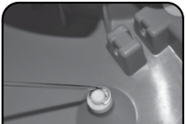

### Operator’s Manual

 Manuel de l’opérateur

 Manual del operador

 Cordless Vacuum

 Aspirateur sans fil

 Aspiradora portátil

###### READ AND SAVE
 THESE INSTRUCTIONS

###### LISEZ ET CONSERVEZ
 CES INSTRUCTIONS

###### LEA Y GUARDE ESTAS
 INSTRUCCIONES

######     ADVERTENCIA: Lea atentamente y comprenda todas las advertencias de seguridad antes de operar De lo contrario puede

######     WARNING: Read carefully and understand all safety warnings before operating. Failure t d lt i i

######     AVERTISSEMENT: Lisez attentivement et comprenez tous les avertissements de sécurité avant de l’utiliser Ne pas le faire peut entraîner

-----

### SAVE THESE INSTRUCTIONS

###### WARNINGS AND USAGE INFORMATION

### WARNING - When using electric appliances, basic precautions should always be followed, including the following:

##### DANGER!

###### 1. Submerge the cleaner completely under water to power ON. Remove the cleaner from water to power OFF.

 2. Do not contact moving parts.

 3. Only use attachments recommended or sold by the manufacturer.

 4. Read carefully and understand all safety warnings before using this appliance.

 5. Do not attempt to operate if the cleaner or charger appear to be damaged in any way.

 6. All cautions and warnings on the equipment should be noted.

 7. Never allow children to operate this product. This is NOT a toy. Children should be supervised to ensure they do not play with this product.

 8. Keep the cleaner and its accessories out of reach of children.

 9. This cleaner is not intended for use by persons with reduced physical, sensory or mental capabilities, or lack of experience and knowledge, unless they have been given supervision or instruction concerning the use of the appliance by a person responsible for their safety.

 10. Charge indoor only. Do not use or store the charger outdoors. Charge your cleaner in a clean, dry place and only with the charger provided. Do not use a charger supplied with any other appliance.

 11. The warnings, cautions, and instruction discussed in this instruction manual cannot cover all possible conditions or situations that could occur. It must be understood, the operator should always exercise intensive caution and common sense when utilizing the cleaner.

 12. Risk of electric shock. Do not expose to liquid, vapor or rain. Store cleaner in a clean dry place. Do not store in direct sunlight or expose to extreme temperatures.

 13. Do not plug or unplug charger into a power source or the appliance with wet hands.
 14. Do not operate this cleaner in the presence of flammable or combustible liquids.

 15. Never service the cleaner while the unit is on or connected to the charger.

 16. Use only the charger supplied with the cleaner. Never carry the charger by its cord or disconnect it from an outlet by pulling on the cord.

 17. Keep proper footing and balance at all times when using the cleaner. Do not overreach.

 18. Please disconnect this equipment from AC outlet before cleaning. Don’t use liquid or sprayed detergent for cleaning. Use moisture sheet or cloth for cleaning.

 19. This cleaner contains rechargeable batteries. Do not incinerate the battery as it will explode at high temperatures. Always dispose of batteries in accordance with local law.

 20. Leaks from a battery may occur under extreme conditions. If battery liquid gets on the skin, wash immediately with water. If it gets in your eyes, immediately flush your eyes with a mild solution of baking soda and water, and seek medical attention.

 21. Keep hair, loose fitting clothing and all body parts away from openings and moving parts of this cleaner.

 USAGE INFORMATION

 22. Use this product only for its intended purpose as described in this manual. Use only Water Tech accessories and filters.

 23. This product is not intended for commercial use.

 24. If the equipment is not in use for long time, disconnect the equipment from mains to avoid being damaged by transient over-voltage.

 25. Never leave your cleaner in water when it is “OFF” or when it has run out of power.

 26. Do not use your cleaner for pool openings; the cleaner is designed for routine maintenance of your pool or spa.

 27. The cleaner is designed for underwater use in swimming pools or spas only. It is not an all purpose vacuum cleaner.

**TO REDUCE THE RISK OF FIRE OR**
**ELECTRIC SHOCK, CAREFULLY FOLLOW**
**THESE INSTRUCTIONS. When using electrical**
products, read, understand and follow all the
instructions stated in this manual.

##### WARNING!

**DROWNING HAZARD. This device produces**
suction. Risk of entrapment present. DO NOT
use when bathers are present. Never permit
children to use this product. Never permit
persons who cannot swim to use this product to
prevent the chance of drowning.

##### DANGER!

**DO NOT ALLOW WATER OR OTHER HIGHLY**
**CONDUCTIVE FLUIDS TO CONTACT THE**
**CHARGER OR CHARGING JACK PRIOR TO**
**OR WHILE CHARGING THE APPLIANCE.**
Pool water is highly corrosive and will cause
damage to the charger or charging jack and can
cause short-circuit resulting in smoke, fire and/or
serious personal injury. Make sure all surfaces
of the charger and charging jack are dry and no
water is present before charging the appliance.

##### WARNING!

**RECHARGE ONLY WITH A CHARGER**
**MANUFACTURED BY WATER TECH**
**CERTIFIED FOR USE WITH THIS PRODUCT.**
A charger suitable for one type of battery pack
may create a risk of fire when used with another
battery pack. DO NOT use an extension cord or
power strip. Use only charger certified by
Water Tech: LC099-3S6SQ.

##### WARNING!

**This appliance contains Li-ion batteries**
**protected from water ingress by factory seal.**
**Do NOT attempt to access the batteries**
**at any time during the active life of the**
**appliance. Risk of shock, fire or short**
**circuit can occur at any time if factory**
**seal is broken.**

###### 28. Avoid picking up sharp objects as they may damage the filter. Keep all openings on the cleaner free of debris which may reduce water flow.

 29. Do not place the cleaner or charger on or near hot surfaces.

 30. For best results use the charger in locations where temperatures are between 50˚ F / 10˚C and 100˚ F / 37.7˚ C.

 31. For connection to a supply not in the U.S.A., use an attachment plug adapter of the proper configuration for the power outlet.

-----

**SYMBOL        SIGNAL                 MEANING**

###### WARNING!

 DANGER!

 CAUTION!

Indicates a hazardous situation, which, if not avoided, could result in death or serious injury.

Indicates a hazardous situation, which, if not avoided, could result in death or serious injury.

Indicates a hazardous situation, that, if not avoided, may result in minor or moderate injury.

###### End of Life Disposal / Recycling Directive

Please respect local regulations and help to protect the environment.

Return non-working electrical equipment to a facility appointed by your municipality that properly recycles electrical and electronic equipment. Do not dispose them in

unsorted waste bins. For items containing removable batteries, remove batteries before disposing of the product.

**Environmental Recycling Programs USA**

Help protect the environment.

-----

###### y

Two year limited warranty from original date of purchase with one year full.

After the first year, the claimant shall pay ½ of the MSRP or List Price of the warranted component.

Water Tech Corp (“WT”) warrants this product, including supplied accessories against defects in material or workmanship to the original purchaser for the time periods as
set forth above and below. Pursuant to this Limited Warranty WT will, at its option (i) repair the product to the original specifications or (ii) replace the product with a new or
refurbished product. In the event of a defect, these are your exclusive remedies. For purposes of this Limited Warranty, “refurbished,” means a product or part that has been
return to its original specifications.

The VOLT battery powered Pool & Spa vacuums, for a period of one (1) year from the original date of purchase of the product, WT will, at its option, repair or replace with
new or refurbished product or parts, any product or parts determined to be defective. After the first year, the claimant shall pay ½ the MSRP or List Price of the warranted
component.

Accessories. Included accessories, filters or poles are covered by this Limited Warranty for a period of (90) days from the original date of purchase of the product.

Instructions. Please retain the original box and internal packaging materials. To obtain warranty service, you must comply with the following requisite instructions:

(1) Visit Water Tech Corp’s Customer Support Department via the web at www.wtrma.com. You will be guided through the correct process on how to obtain the required
RMA# (Return Merchandise Authorization Number.) All customers must obtain an RMA number before any product will be accepted for warranty service. If you need
additional assistance, please contact us by telephone: (1-732-967-9888) or email: customerservice@watertechcorp.com.
(2) Package the unit and the WT battery charger only (if the unit requires a WT charger ) properly and securely in the original box.
(3) Attach your RMA number and Bar-Code you received from the website to the outside of the package. If you could not print the RMA number and bar-code from the
website you must write your RMA number in thick black indeligable marker on two sides of the box.
(4) Send the package by USPS or express courier of choice to: Water Tech Corp, 10 Alvin Court, East Brunswick, New Jersey 08816; (WT suggests you insure the contents of
your package.) WT is not responsible for lost, stolen or damaged property in transit to WT.

Repair/Replacement Warranty. This Limited Warranty shall apply to any repair, replacement part or replacement product for the remainder of the original Limited Warranty
period or for ninety (90) days, whichever is longer. Any parts or products replaced shall become the property of WT.

This Limited Warranty covers only product issues caused by defects in material or workmanship during ordinary consumer use; it does not cover product issues caused by any
other reasons, including but not limited to product issues caused by commercial use, acts of God, misuse, abuse, limitations in technology, or modification of or to any part of
the WT product. This Limited Warranty does not cover WT products sold AS IS or WITH ALL FAULTS or consumables (such as batteries). This Limited Warranty is invalid if
the factory-applied serial number has been altered or removed from the product. This Limited Warranty is valid only in the United States and Canada.

EXPRESS LIMITATION: THIS LIMITED WARRANTY ONLY APPLIES IF THE PRODUCT WAS PURCHASED FROM AN AUTHORIZED WATER TECH DEALER.
THIS WARRANTY IS NOT TRANSFERABLE

LIMITATION ON DAMAGES. WT WILL NOT BE LIABLE FOR ANY INCIDENTAL OR CONSEQUENTIAL DAMAGES FOR BREACH OF EXPRESS OR IMPLIED
WARRANTY ON THIS PRODUCT.

DURATION OF IMPLIED WARRANTIES. EXCEPT TO THE EXTENT PROHIBITED BY APPLICABLE LAW, ANY IMPLIED WARRANTY OF MERCHANTABILITY
OR FITNESS FOR A PARTICULAR PURPOSE ON THIS PRODUCT IS LIMITED IN DURATION OF THIS WARRANTY.

Some states do not allow the exclusion or limitation of incidental or consequential damages, or allow limitations or how long an implied warranty lasts, so the above limitations
or exclusions may not apply to you. This Limited Warranty gives you specific legal rights and you may have other rights, which vary from state to state.

###### Industry Canada Regulatory Information CAN ICES-3 (B)/NMB-3 (B) Avis d’Industrie Canada CAN ICES-3 (B)/NMB-3 (B)

 FCC Compliance

This device complies with Part 15 of the FCC Rules. Operation is subject to the following two conditions:
(1) This device may not cause harmful interference, and (2) this device must accept any interference received, including interference that may cause undesired
operation.

NOTE: This equipment has been tested and found to comply with the limits for a Class B digital device, pursuant to Part 15 of the FCC Rules. These limits are
designed to provide reasonable protection against harmful interference in a residential installation. This equipment generates, uses and can radiate radio fre­
quency energy and, if not used in accordance with the instructions, may cause harmful interference to radio communications. However, there is no guarantee that
interference will not occur in a particular installation, If this equipment does cause harmful interference to radio or television reception, which can be determined by
turning the equipment off and on, the user is encouraged to try and correct the interference by one or more of the following measures:

- Reorient or relocate the receiving antenna.

- Increase the separation between the equipment and receiver.

- Connect the equipment into an outlet on a circuit different than that to which the receiver is connected.

- Consult the dealer or an experienced radio/TV technician for help.

-----

##### 4

SOLID RED SOLID GREEN

|B Closing Charging Port|C Securing Pole Adapter|Col3|
|---|---|---|
|D Attaching Filter Bag|E Inserting Pool Pole (Not included)||
|F Turning The cleaner is equipped with a water sensor that automatically Unit ON/OFF powers the unit ON and OFF. Power ON, submerge in water. (2 second delay). Power OFF, remove from water.||G Surface Cleaning|

## H

###### Adjusting Clearance Height

##### H.1 H.2 H.3 H.4

-----

###### SKU: 11A0060LS

 Only use the battery charger supplied with the cleaner.

 Specifications
Battery charger Input.........................................................................100-240V-50-60Hz, 0.3A Maximum

Battery charger Output.......................................................................................................12.6V,    1.A

Battery Technical Data................................................................11.1V, 2200mAh, 24.42Wh, 3S1P Li-Ion

Water temperature range................................................... Maximum 96°F, (35°C) Minimum 40°F, (5°C)
Operation Depth.......................................................... Maximum 12 ft. (3.5 m), Minimum 10 in. (0.25 m)

Charge temperature.................................................... Maximum 100°F, (37.7°C) Minimum 50°F, (10°C)

###### 3

 4

P11AX022AP
P11A062VTR

P11A050LD

LC099-3S6SQ

###### 4

(1) Filter Bag
(2) Pole Adapter
(3) Wheel Assembly
(4) Charger and EU Adapter

##### A Charging Your Cleaner F Turning Unit ON/OFF

###### Initial Charge 4 Hours Recharging (After Complete Discharge) 4 Hours Maximum charging time should not exceed 24 Hours

###### The cleaner is equipped with a water sensor that automatically powers the unit ON and OFF. Power ON, submerge in water. (2 second delay). Power OFF, remove from water.

**_Note:_**
_While cleaning, leaves may settle around the propeller reducing cleaning_
_effectiveness. Should this occur, just shake the Leaf Vac back and forth to_
_dislodge the settling leaves and continue cleaning._

##### B

 C
 D E

 G

 H

###### Closing Charging Port

 Securing Pole Adapter

 Attaching Filter Bag

 Inserting Pool Pole (Not included)

 SURFACE CLEANING AND ADJUSTING CLEARANCE HEIGHT

 Surface Cleaning

###### Push the pole adapter down until the adapter locks in place. Submerge the cleaner to turn it “ON”. The Leaf Vac may now be used in the “Wheels Up” position to skim leaves and other floating debris from the pool’s surface.

 Adjusting Clearance Height

 The Leaf Vac is packaged with its clearance height in the “LOW” position. The height of the Leaf Vac can be raised up to 1/4 inch if needed by doing the following: H.1 - Use a small screwdriver or pair of needle-nose pliers to remove the “E”-clip from the top of the wheel pivot shaft. H.2 - Remove the wheel pivot shaft assembly. Don’t lose the “E” - clip and spacer. H.3 - Place the spacer on the pivot shaft and guide the shaft back into the body from beneath. H.4 - Replace the “E”-clip on the top of the shaft.

 Repeat these procedures on the remaining 2 wheel pivot assemblies.

 MAINTENANCE AND LONG TERM STORAGE

 Cleaning the Filter Bag
 • You should remove and clean the Filter Bag following each use.
 • Clean out the debris bag following each use and carefully remove any debris that might be stuck in the propeller area of the cleaner.
 • Don’t scrub the bag against itself while rinsing it.

 Long Term Storage
 • Always clean the Unit and Filter Bag before storing.
 • Always store and charge your cleaner in a cool dry indoor shelter

-----

### CONSERVEZ CES INSTRUCTIONS

###### AVERTISSEMENTS ET INFORMATIONS D’UTILISATION

#### AVERTISSEMENT - Lors de l’utilisation d’appareils électriques, des précautions de base doivent toujours être
###### suivies, notamment les suivantes :

##### DANGER!

###### 1. Immergez complètement le nettoyeur sous l’eau pour le mettre sous tension. Retirez le nettoyeur de l’eau pour l’éteindre.

 2. Ne touchez pas les pièces mobiles.

 3. Utilisez uniquement les accessoires recommandés ou vendus par le fabricant.

 4. Lisez attentivement et comprenez tous les avertissements de sécurité avant d’utiliser cet appareil.

 5. N’essayez pas de fonctionner si le nettoyeur ou le chargeur semble être endommagé de quelque manière que ce soit.

 6. Toutes les mises en garde et avertissements sur l’équipement doivent être notés.

 7. Ne permettez jamais aux enfants d’utiliser ce produit. Ce n’est PAS un jouet. Les enfants doivent être surveillés pour s’assurer qu’ils ne jouent pas avec ce produit.
 8. Gardez le nettoyant et ses accessoires hors de portée des enfants.

 9. Ce nettoyant n’est pas destiné à être utilisé par des personnes ayant des capacités physiques, sensorielles ou mentales réduites, ou un manque d’expérience et de connaissances, à moins qu’elles n’aient reçu une supervision ou des instructions concernant l’utilisation de l’appareil par une personne responsable de leur sécurité.

 10. Chargez à l’intérieur seulement. N’utilisez pas et ne rangez pas le chargeur à l’extérieur. Chargez votre nettoyeur dans un endroit propre et sec et uniquement avec le chargeur fourni. N’utilisez pas de chargeur fourni avec un autre appareil.

 11. Les avertissements, les mises en garde et les instructions décrits dans ce manuel d’instructions ne peuvent pas couvrir toutes les conditions ou situations possibles qui pourraient se produire. Il faut le comprendre, l’opérateur doit toujours faire preuve d’une prudence et d’un bon sens lors de l’utilisation du nettoyant.

 12. Risque de choc électrique. Ne pas exposer au liquide, à la vapeur ou à la pluie. Conservez le nettoyant dans un endroit propre et sec. Ne pas stocker à la lumière directe du soleil ou exposer à des températures extrêmes.

 13. Ne branchez pas ou ne débranchez pas le chargeur d’une source d’alimentation ou de l’appareil avec les mains mouillées.

 14. Ne pas utiliser ce nettoyant en présence de liquides inflammables ou combustibles.

 15. N’entretenez jamais le nettoyeur lorsque l’appareil est allumé ou connecté au chargeur.

 16. Utilisez uniquement le chargeur fourni avec le nettoyeur. Ne portez jamais le chargeur par son cordon ou ne le débranchez jamais d’une prise en tirant sur le cordon.

 17. Gardez une bonne assise et un bon équilibre en tout temps lorsque vous utilisez le nettoyant. N’exagérez pas.

 18. Veuillez débrancher cet équipement de la prise secteur avant de le nettoyer. N’utilisez pas de liquide ou de détergent en aérosol pour le nettoyage. Utilisez une feuille ou un chiffon humide pour le nettoyage.

 19. Ce nettoyant contient des piles rechargeables. N’incinérez pas la batterie car elle explosera à haute température. Jetez toujours les piles conformément à la loi locale.

 20. Des fuites d’une batterie peuvent se produire dans des conditions extrêmes. Si le liquide de la batterie pénètre sur la peau, lavez-le immédiatement à l’eau. S’il pénètre dans vos yeux, rincez immédiatement vos yeux avec une solution légère de bicarbonate de soude et d’eau, et consultez un médecin.

 21. Gardez les cheveux, les vêtements amples et toutes les parties du corps loin des ouvertures et des parties mobiles de ce nettoyant.

 INFORMATIONS D’UTILISATION

 22. Utilisez ce produit uniquement aux fins prévues, comme décrit dans le présent manuel. Utilisez uniquement des accessoires et des filtres Water Tech.

 23. Ce produit n’est pas destiné à un usage commercial.

 24. Si l’équipement n’est pas utilisé pendant une longue période, débranchez l’équipement du secteur pour éviter d’être endommagé par une surtension transitoire.

 25. Ne laissez jamais votre nettoyeur dans l’eau lorsqu’il est « ÉTEINT » ou lorsqu’il est à court d’électricité. 

 26. N’utilisez pas votre nettoyant pour les ouvertures de piscine; le nettoyeur est conçu pour l’entretien de routine de votre piscine ou spa.

**POUR RÉDUIRE LE RISQUE D’INCENDIE**
**OU D’ÉLECTROCUTION, SUIVRE**
**ATTENTIVEMENT CES INSTRUCTIONS.**
Lorsque vous utilisez des produits électriques,
lisez, comprenez et suivez toutes les instructions
indiquées dans ce manuel.

##### AVERTISSEMENT!

**RISQUE DE NOYADE. Ce dispositif produit**
d’aspiration. Risque de piégeage. NE PAS
utiliser en présence de baigneurs. Ne jamais
permettre aux enfants d’utiliser ce produit. Ne
permettez jamais aux personnes qui ne savent
pas nager d’utiliser ce produit pour éviter les
risques de noyade.

##### DANGER!

**NE PAS PERMETTRE À L’EAU OU À**
**D’AUTRES LIQUIDES TRÈS CONDUCTEURS**
**DE CONTACTER LE CHARGEUR OU LA**
**PRISE DE CHARGE AVANT OU PENDANT LE**
**CHARGEMENT DE L’APPAREIL. L’eau de la**
piscine est très corrosive et peut endommager le
chargeur ou la prise de charge et peut causer un
court-circuit entraînant de la fumée, un incendie
et / ou des blessures graves. Assurez-vous que
toutes les surfaces du chargeur et de la prise de
charge sont sèches et qu’il n’ya pas d’eau avant
de charger l’appareil.

##### AVERTISSEMENT!

**RECHARGEZ SEULEMENT AVEC UN**
**CHARGEUR FABRIQUÉ PAR WATER TECH**
**CERTIFIÉE POUR L’UTILISATION AVEC CE**
**PRODUIT. Un chargeur adapté à un type de**
batterie peut créer un risque d’incendie lorsqu’il
est utilisé avec une autre batterie. N’UTILISEZ
**PAS de rallonge ou de multiprise. Utilisez**
uniquement le chargeur certifié par
Water Tech: LC099-3S6SQ.

##### AVERTISSEMENT!

**Cet appareil contient des batteries Li-ion**
**protégées contre la pénétration d’eau par**
**un joint d’usine. N’essayez PAS d’accéder**
**aux piles à tout moment pendant la durée de**
**vie active de l’appareil. Un risque de choc,**
**d’incendie ou de court-circuit peut survenir à**
**tout moment si le joint d’usine est brisé.**

###### 27. Le nettoyeur est conçu pour une utilisation sous-marine dans les piscines ou les spas uniquement. Ce n’est pas un aspirateur tout usage.

 28. Évitez de ramasser des objets tranchants car ils pourraient endommager le filtre. Gardez toutes les ouvertures du nettoyeur exemptes de débris qui peuvent réduire le débit d’eau.

 29. Ne placez pas le nettoyant ou le chargeur sur ou près de surfaces chaudes.

 30. Pour de meilleurs résultats, utilisez le chargeur dans des endroits où les températures sont comprises entre 50 ° F / 10 ° C et 100 ° F / 37,7 ° C.

 31. Pour le raccordement à une alimentation qui n’est pas aux États-Unis, utilisez un adaptateur de prise de fixation de la configuration appropriée pour la prise de courant.

-----

**SYMBOLE      SIGNAL                   SENS**

###### AVERTISSEMENT!

 DANGER!

 PRUDENCE!

Indique une situation dangereuse qui, si elle n’est pas évitée, pourrait entraîner la mort ou des
blessures graves.

Indique une situation dangereuse qui, si elle n’est pas évitée, pourrait entraîner la mort ou des
blessures graves.

Indique une situation dangereuse qui, si elle n’est pas évitée, peut entraîner des blessures mineures
ou modérées.

###### 4

###### Directive sur l’élimination et le recyclage en fin de vie

Veuillez respecter les réglementations locales et contribuer à la protection de l’environnement. Retourner les appareils électriques défectueux à un organisme chargé de recycler

les appareils électriques et électroniques. Ne pas les jeter à la poubelle. Pour les articles à piles, retirer les piles avant de recycler les produits.

**Protection de l’environnement USA**

Aider à protéger l’environnement.

-----

##### 4

ROUGE UNI VERT UNI

|B Fermeture du port de charge|C Insertion de l’adaptateur de poteau|Col3|
|---|---|---|
|D Fixation du sac filtrant|E Insertion du pôle de piscine (Non inclus)||
|F Mise en Le nettoyeur est équipé d’un capteur d’eau qui allume et éteint marche/arrêt automatiquement l’appareil. Allumer, plonger dans de l’appareil l’eau. (délai de 2 secondes). Éteignez, retirez de l’eau.||G Nettoyage de la surface|

## H

###### Réglage de la hauteur de dégagement

##### H.1 H.2 H.3 H.4

-----

###### UGS: 11A0060LS 3

 Utilisez uniquement le chargeur fourni avec votre produit nettoyant.

###### 4

###### Spécifications
Chargeur de batterie entrée..............................................................100-240V-50-60Hz, 0.3A Maximum

Chargeur de batterie sortie............................................................................................... 12.6V,    1.A

Batterie données techniques........................................................11.1V, 2200mAh, 24.42W, 3S1P Li-Ion

Plage de température de l’eau........................................... Maximum 96°F, (35°C) Minimum 40°F, (5°C)
Opération profondeur.................................................. Maximum 12 ft. (3.5 m), Minimum 10 in. (0.25 m)

Température de charge............................................... Maximum 100°F, (37.7°C) Minimum 50°F, (10°C)

P11AX022AP
P11A062VTR

P11A050LD

LC099-3S6SQ

(1) Sac-filtre
(2) Adaptateur de poteau
(3) Assemblage de roue
(4) Chargeur et l’adaptateur de l’UE

##### A Charge de l’aspirateur F Mise en marche et arrêt de l’aspirateur

###### Charge initiale 4 heures Recharge (Après décharge complète) 4 heures Le temps de charge maximal ne doit pas dépasser 24 heures

###### Le nettoyeur est équipé d’un capteur d’eau qui allume et éteint automatiquement l’appareil. Allumer, immerger dans l’eau. (délai de 2 secondes). Éteignez, retirez de l’eau.

**_Remarque:_**
_Pendant le nettoyage, des feuilles peuvent s’accumuler autour de l’hélice_
_réduisant l’efficacité du nettoyage. Dans ce cas, secouez simplement l’aspirateur_
_d’avant en arrière pour déloger les feuilles, et continuez le nettoyage._

##### B

 C D

 E

 G

 H

###### Fermeture du port de charge

 Insertion de l’adaptateur de poteau

 Fixation du sac filtrant

 Insertion du pôle de piscine (Non inclus)

 NETTOYAGE DE LA SURFACE ET RÉGLAGE DE LA HAUTEUR DE DÉGAGEMENT

 Nettoyage de la surface

###### Poussez l’adaptateur de pôle vers le bas jusqu’à ce qu’il se verrouille en place. Immergez le nettoyeur pour l’allumer. Le Leaf Vac peut maintenant être utilisé en position « Roule vers le haut » pour écrémer les feuilles et autres débris flottants de la surface de la piscine.

 Réglage de la hauteur de dégagement

 L’aspirateur à feuilles est livré avec une hauteur de dégagement en position basse. La hauteur de l’aspirateur à feuilles peut être augmentée jusqu’à 1/4 po si nécessaire en procédant comme suit: H.1 - Utilisez un petit tournevis ou une paire de pinces à bec effilé pour retirer l’attache en E en haut de l’arbre de pivot de roue. H.2 - Retirez l’arbre de pivot de roue. Veillez à ne pas égarer l’attache en E et la cale d’espacement. H.3 - Placez la cale sur l’arbre de pivot et guidez l’arbre dans l’aspirateur par le dessous. H.4 - Replacez l’attache en E en haut de l’arbre. 

 Répétez ces étapes sur les deux pivots de roue restants.

 MAINTENANCE ET ENTREPOSAGE À LONG TERME

 Nettoyage du sac filtrant
 • Il est recommandé de retirer et de nettoyer le sac-filtre après chaque utilisation
 • Nettoyez le sac de débris après chaque utilisation et retirez soigneusement tous les débris qui pourraient être
 coincés dans la zone de l’hélice de l’aspirateur.

 • Ne frottez pas le sac contre lui-même pendant le rinçage.

 Remisage à long terme
 • Toujours nettoyer le conteneur de débris et le sac-filtre avant de remiser l’aspirateur.
 • Toujours stocker et charger votre aspirateur dans un abri intérieur frais et sec

-----

# IMPORTANTES

### GUARDE ESTAS INSTRUCCIONES

###### ADVERTENCIAS Y INFORMACIÓN DE USO

#### ADVERTENCIA - Al usar aparatos eléctricos, siempre se deben seguir las precauciones básicas, incluidas
###### las siguientes:

 1. Sumerja el limpiador completamente bajo el agua para encenderlo. Retire el limpiador del agua para apagarlo.

 2. No entre en contacto con las partes móviles.

 3. Utilice únicamente los accesorios recomendados o vendidos por el fabricante.

 4. Lea detenidamente y comprenda todas las advertencias de seguridad antes de usar este aparato.

 5. No intente operar si el limpiador o el cargador parecen estar dañados de alguna manera.

 6. Se deben tener en cuenta todas las precauciones y advertencias en el equipo.

 7. Nunca permita que los niños operen este producto. Esto NO es un juguete. Los niños deben ser supervisados para asegurarse de que no jueguen con este producto.

 8. Mantenga el limpiador y sus accesorios fuera del alcance de los niños..

 9. Este limpiador no está destinado a ser utilizado por personas con capacidades físicas, sensoriales o mentales reducidas, o falta de experiencia y conocimiento, a menos que hayan recibido supervisión o instrucción sobre el uso del aparato por parte de una persona responsable de su seguridad.

 10. Cargue solo en interiores. No use ni guarde el cargador al aire libre. Cargue su limpiador en un lugar limpio y seco y solo con el cargador provisto. No utilice un cargador suministrado con ningún otro aparato. . 11. Las advertencias, precauciones e instrucciones discutidas en este manual de instrucciones no pueden cubrir todas las condiciones o situaciones posibles que podrían ocurrir. Debe entenderse, el operador siempre debe ejercer precaución intensiva y sentido común al utilizar el limpiador.

 12. Riesgo de descarga eléctrica. No exponer a líquido, vapor o lluvia. Guarde la limpiadora en un lugar limpio y seco. No almacene a la luz solar directa ni exponga a temperaturas extremas.

 13. No enchufe ni desenchufe el cargador a una fuente de alimentación o al aparato con las manos mojadas.

 14. No utilice este limpiador en presencia de líquidos inflamables o combustibles.

 15. Nunca realice el mantenimiento del limpiador mientras la unidad esté encendida o conectada al cargador.

 16. Utilice únicamente el cargador suministrado con el limpiador. Nunca lleve el cargador por su cable ni lo desconecte de una toma de corriente tirando del cable.

 17. Mantenga una base y un equilibrio adecuados en todo momento cuando use el limpiador. No te excedas.
 18. Desconecte este equipo de la toma de CA antes de limpiar. No use detergente líquido o rociado para la limpieza. Use una lámina o paño de humedad para la limpieza.

 19. Este limpiador contiene baterías recargables. No incinere la batería, ya que explotará a altas temperaturas. Siempre deseche las baterías de acuerdo con la ley local.

 20. Las fugas de una batería pueden ocurrir en condiciones extremas. Si el líquido de la batería entra en contacto con la piel, lávese inmediatamente con agua. Si entra en contacto con sus ojos, enjuáguese inmediatamente los ojos con una solución suave de bicarbonato de sodio y agua, y busque atención médica.

 21. Mantenga el cabello, la ropa holgada y todas las partes del cuerpo lejos de las aberturas y partes móviles de este limpiador.

 INFORMACIÓN SOBRE EL USO

 22. Utilice este producto solo para el propósito previsto como se describe en este manual. Utilice solo accesorios y filtros Water Tech.

 23. Este producto no está destinado a uso comercial.

 24. Si el equipo no se usa por mucho tiempo, desconecte el equipo de la red eléctrica para evitar daños por sobretensión transitoria.

 25. Nunca deje la limpiadora en agua cuando esta esté en “OFF” (apagada) o sin suministro de energía (batería descargada).

 26. No utilice la limpiadora al inicio de la temporada de uso de la piscina; la limpiadora está diseñada para el mantenimiento de rutina de su piscina o bañera de hidromasaje.

##### ¡PELIGRO!

**PARA REDUCIR EL RIESGO DE**
**INCENDIO O CHOQUE ELÉCTRICO,SIGA**
**CUIDADOSAMENTE ESTAS INSTRUCCIONES.**
Cuando use productos eléctricos, lea, comprenda
y siga todas las instrucciones indicadas en este
manual.

##### ¡ADVERTENCIA!

**RIESGO DE AHOGAMIENTO. Este dispositivo**
produce succión. Riesgo de atrapamiento
presente. NO USE cuando haya bañistas
presentes. Nunca permita que los niños usen
este producto. Nunca permita que las personas
que no pueden nadar usen este producto para
evitar la posibilidad de ahogarse.

##### ¡PELIGRO!

**NO PERMITA QUE AGUA U OTROS**
**LÍQUIDOS ALTAMENTE CONDUCTORES**
**CONTACTEN EL CARGADOR O CONECTOR**
**DE CARGA ANTES O MIENTRAS SE CARGA**
**EL APARATO. El agua de la piscina es**
altamente corrosiva y causará daños al cargador
o al conector de carga y puede provocar
un cortocircuito que puede provocar humo,
incendios y / o lesiones personales graves.
Asegúrese de que todas las superficies del
cargador y conector de carga están secas y
agua no está presente antes de cargar
el aparato.

##### ¡ADVERTENCIA!

**RECARGUE SOLAMENTE CON UN**
**CARGADOR FABRICADO POR WATER**
**TECH CERTIFICADO PARA USO CON ESTE**
**PRODUCTO. Un cargador adecuado para un**
tipo de paquete de baterías puede crear un
riesgo de incendio cuando se usa con otro
paquete de baterías. NO USE un cable de
extensión o regleta de enchufes. Use solo el
cargador certificado por Water Tech:
LC099-3S6SQ.

##### ¡ADVERTENCIA!

**Este aparato contiene baterías de iones de**
**litio protegidas de la entrada de agua por**
**sello de fábrica. NO intente acceder a las**
**baterías en ningún momento durante la vida**
**activa del aparato. El riesgo de choque,**
**incendio o cortocircuito puede ocurrir en**
**cualquier momento si se rompe el sello**
**de fábrica.**

###### 27. La limpiadora está diseñada para uso bajo el agua en piscinas o bañeras de hidromasaje únicamente. No es una limpiadora aspiradora multiuso.

 28. Evite recoger objetos afilados, ya que pueden dañar el filtro. Mantenga todas las aberturas en el limpiador libres de escombros que puedan reducir el flujo de agua.

 29. 29. No coloque el limpiador o el cargador sobre o cerca de superficies calientes.

 30. Para obtener los mejores resultados, use el cargador en lugares donde las temperaturas estén entre 50 ° F / 10 ° C y 100 ° F / 37.7 ° C.

 31. Para la conexión a una fuente que no esté en los EE. UU., Utilice un adaptador de enchufe de conexión de la configuración adecuada para la toma de corriente.

-----

Los siguientes símbolos y significados están destinados a explicar los niveles de riesgo asociados con este producto:

**SÍMBOLO     SEÑAL              SIGNIFICADO**

###### ¡ADVERTENCIA!

 ¡PELIGRO!

 ¡PRECAUCIÓN!

Indica una situación peligrosa que, si no se evita, podría causar la muerte o lesiones graves.

Indica una situación peligrosa que, si no se evita, podría causar la muerte o lesiones graves.

Indica una situación peligrosa, que si no se evita, podría resultar en lesiones menores o moderadas.

###### 4

###### Directiva para disposición / reciclaje de fin de vida

Por favor respete el reglamento o reglamentación local y ayude a proteger el ambiente. Retorno los equipos eléctricos que no trabajan a un centro designado por el municipio

que recicle equipos eléctricos y electrónicos. No deseche en contenedores de residuos sin clasificar. Para los artículos que contienen baterías extraíbles, quite la batería antes de

eliminar el producto.

-----

##### 4

ROJO SÓLIDO VERDE SOLIDO

|B Cierre del puerto de carga|C Inserción del adaptador de palo de piscina|Col3|
|---|---|---|
|D Colocación de la bolsa de filtro|E Insertar el palo de piscina (No incluido)||
|F Encendido/ El limpiador está equipado con un sensor de agua que enciende apagado de y apaga automáticamente la unidad. Encienda: sumérjase en la unidad agua. (2 segundos de retraso). Apagar: quitar del agua.||G Para limpiar la superficie|

## H

###### Ajuste de la altura

##### H.1 H.2 H.3 H.4

-----

###### Número de unidad: 11A0060LS 3

 Utilice sólo el cargador de la batería incluida con el limpiador.

###### 4

###### Especificaciones
Cargador de batería entrada................................................................100-240V-50-60Hz, 0.3A Máximo

Cargador de batería salida................................................................................................12.6V,    1.A

Datos técnicos de batería..........................................................11.1V, 2200mAh, 24.42Wh, 3S1P Li-Ion

Rango de temperatura de agua............................................... Máximo 96°F, (35°C) Mínimo 40°F, (5°C)
Profundidad de operación................................................. Máximo 12 ft. (3.5 m), Mínimo 10 in. (0.25 m)

Temperatura de carga....................................................... Máximo 100°F, (37.7°C) Mínimo 50°F, (10°C)

P11AX022AP
P11A062VTR

P11A050LD

LC099-3S6SQ

(1) Bolsa de filtro
(2) Adaptador para palo de piscina
(3) Conjunto de rueda
(4) Cargador y adaptador de la UE

##### A Cómo cargar la limpiadora F Cómo encender y apagar la limpiadora

###### Carga inicial 4 Horas Recarga (Después de descarga completa) 4 Horas El tiempo máximo de carga no debe exceder las 24 horas

###### El limpiador está equipado con un sensor de agua que enciende y apaga automáticamente la unidad. Encienda: sumérjase en agua. (2 segundos de retraso). Apagar: quitar del agua

**_Nota:_**
_Mientras limpia, las hojas se pueden acumular alrededor de la hélice disminuyendo la_
_efectividad de la limpieza. Si esto ocurre, simplemente sacuda la aspiradora de hojas_
_hacia atrás y hacia adelante para expulsar las hojas acumuladas y continúe limpiando._

##### B C

 D E

 G

 H

###### Cierre del puerto de carga

 Inserción del adaptador de palo de piscina
 Colocación de la bolsa de filtro

 Insertar el palo de piscina (No incluido)

 LIMPIEZA DE SUPERFICIES Y AJUSTE DE LA ALTURA

 Para limpiar la superficie

###### Empuje el adaptador de poste hacia abajo hasta que el adaptador se bloquee en su lugar. Sumerge la aspiradora de hojas para encenderlo. La aspiradora de hojas ahora se puede usar en la posición “Ruedas arriba” para desnatar hojas y otros desechos flotantes de la superficie de la piscina.
 Ajuste de la altura
 Su aspiradora de hojas viene con la altura de seguridad en la posición LOW (bajo). La altura de la aspiradora de hojas se puede elevar hasta 1/4 de pulgada (6 mm) si fuese necesario para hacer lo siguiente: H.1 - Use un destornillador pequeño o alicate de punta fina para retirar el sujetador “E” de la parte superior del eje pivotante de la rueda. H.2 - Retire el ensamble del eje pivotante de la rueda. No pierda el sujetador “E” ni el espaciador. H.3 - Coloque el espaciador en el eje pivotante y guíelo de nuevo hacia adentro del cuerpo de la aspiradora desde la parte de abajo. H.4 - Vuelva a colocar el sujetador en “E” en la parte superior del eje.

 Repita estos procedimientos en los ensambles del eje pivotante restantes de dos ruedas.

 MANTENIMIENTO Y ALMACENAMIENTO A LARGO PLAZO

 Cómo limpiar la bolsa del filtro
 • Debe retirar y limpiar la bolsa del filtro después de cada uso
 • Limpie la bolsa de residuos después de cada uso y retire con cuidado cualquier residuo que pueda estar atascado en el
 área de la hélice del limpiador.

 • No frote la bolsa contra sí misma mientras se lava.

 Almacenaje a largo plazo
 • Siempre limpie la unidad y la bolsa del filtro antes de guardar el equipo.
 • Siempre guarde y cargue su limpiador en un refugio interior fresco y seco

-----

contact your local authority for information.

**WARNING!**

- Never attempt to disassemble a battery pack.
1. Remove all personal items such as rings, bracelets, necklaces and watches when unwiring a pack from the vacuum unit.
2. A battery can produce a short circuit current high enough to weld a ring (or like item) to metal causing a severe burn.
3. Wear complete eye protection, gloves and protective clothing when removing the battery pack.
4. Take care not to touch wires together or allow them to contact any metal items, which would cause sparking and/or short circuit the battery.
5. Never smoke or allow a spark or flame in the vicinity of the battery or the cleaner. Batteries can generate gases which could possibly ignite.
6. Do not expose to fire or intense heat as this may result in an explosion.
**CAUTION!**

- If a battery leak develops, avoid contact with the leaking acid and place the damaged battery in a plastic bag.
7. If acid comes in contact with skin and clothing, wash immediately with plenty of soap and water.
8. If acid comes in contact with eyes, immediately flood eye with running cool water for at least 15 minutes. Get medical attention immediately. Please refer to

the following URL for safety data sheet for further guidance: https://watertechcorp.com/msds/

**How to remove the battery**

- Recommended tools (not included): Torx head screwdriver, wire-cutters, electrical tape.

1. Remove battery chamber cap. Using a Torx head screwdriver, unfasten the 2 screws on the motor box cap.
2. Pull the battery out shown in image two.
4. Using the wire-cutters, cut the wires as shown in image three. Do not cut both wires at the same time.
5. Wrap the wires with electrical tape. Dispose according to local law.

###### FIN DE VIE ÉLIMINATION DES PILES - FR

La batterie lithium-ion sans entretien de votre unité doit être éliminée conformément à la législation nationale et locale. Pour confirmer si le recyclage est
requis; contactez votre autorité locale pour obtenir des informations.

**AVERTISSEMENT !**

- S’assurer que la batterie est déchargée avant de démonter l’aspirateur.
1. Retirer tous les objets métalliques tels que des anneaux, bracelets, colliers et montres lors du la déconnexion de la batterie.

Une batterie de ce type peut entraîner un court-circuit suffisant pour souder un anneau (ou tout objet similaire) avec du métal, provoquant des
brûlures sévères.

2. Une batterie peut produire un courant de court-circuit suffisamment élevé pour souder un anneau (ou un objet similaire) au

métal, provoquant une brûlure grave.

3. Porter une protection oculaire complet, gants et vêtements de protection lorsque vous retirez la batterie.
4. Veillez à ne pas toucher les fils ensemble ou à les laisser entrer en contact avec des objets métalliques, ce qui pourrait

provoquer des étincelles et / ou court-circuiter la batterie.

5. Ne jamais fumer ou laisser une étincelle ou une flamme à proximité de la batterie ou du nettoyeur. Les batteries peuvent

générer des gaz qui pourraient éventuellement s’enflammer.

6. Ne pas exposer au feu ou à une chaleur intense car cela peut entraîner une explosion.

**ATTENTION!**

- En cas de fuite, évitez tout contact avec l’acide qui fuit et placez la batterie endommagée dans un sac en plastique.

7. Si l’acide entre en contact avec la peau et les vêtements, rincez immédiatement à grande eau et au savon.
8. Si de l’acide entre en contact avec les yeux, rincez immédiatement les yeux avec de l’eau froide pendant au moins 15 minutes. Obtenez des soins médicau

immédiatement. Prière de se référer à l’URL suivante pour la fiche de données de sécurité pour plus d’informations: https://watertechcorp.com/msds/

**Comment retirer la batterie**

- Outils recommandés (non fournis) Tournevis à tête torx, coupe-fil, ruban isolant.

1. Retirez le couvercle du logement de la batterie. À l’aide d’un tournevis à tête torx, dévissez les 2 vis du couvercle du boîtier du moteur.
2. Retirez la batterie illustrée dans l’image deux.
3. À l’aide des coupe-fils, couper les fils comme le montre l’image trois. Ne coupez pas les deux fils en même temps.
4. Enveloppez les fils avec du ruban électrique. Éliminer conformément à la loi locale.

###### ELIMINACIÓN DE BATERÍAS AL FINAL DE VIDA - ES

La batería de iones de litio que no requiere mantenimiento en su Pool Blaster debe desecharse de acuerdo con las leyes estatales y locales. Para confirmar si
se requiere reciclaje; contacte a su autoridad local para obtener información.

**ADVERTENCIA!**

- Nunca trate de desarmar una batería.
1. Retire todos las objetos personales coma anillos, pulseras, collares y relojes cuando realice la extracción de una batería. Una

batería puede producir un cortocircuito y la corriente lo suficientemente alta para soldar un anillo (o similar) al metal, causando una quemadura grave.

2. Una batería puede producir una corriente de cortocircuito lo suficientemente alta como para soldar un anillo (o elemento

similar) al metal, causando una quemadura grave.

3. Use protección ocular completa, guantes y ropa protectora cuando retire la batería.
4. Tenga cuidado de no tocar cables juntos o les permiten entrar en contacto con objetos metálicos, que pueda causar chispas o

cortocircuito la batería.

5. Nunca fume ni permita que haya chispas o llamas cerca de la batería o del limpiador. Las baterías pueden generar gases que

posiblemente podrían encenderse.

6. No exponer al fuego o al calor intenso, ya que esto puede provocar una explosión.

**¡PRECAUCIÓN!**

- Si se produce una fuga de la batería, evite el contacto con el ácido que gotea y coloque la batería dañada en una bolsa

-----

**Como quitar la batería**

- Herramientas recomendadas (no incluidas): Destornillador de cabeza torx, cortadores de alambre, cinta aislante.

1. Quite la tapa de la cámara de la batería. Con un destornillador de cabeza torx, afloje los 2 tornillos de la tapa de la caja del motor.
2. Saca la batería indicada en la imagen dos.
3. Usando los cortadores de alambre, corte los alambres como se muestra en la imagen tres. No corte ambos cables al mismo tiempo.
4. Enrolle los cables con cinta aislante. Eliminar según las leyes locales.

##### 1 2 3 4

2. Saca la batería indicada en la imagen dos.

4. Enrolle los cables con cinta aislante. Eliminar según las leyes locales.

##### 1 2

-----

-----

-----

###### This page has been left blank intentionally.
 Cette page a été laissé vide intentionnellement.
 Esta página se ha dejado en blanco intencionalmente.
 Esta página foi deixada em branco intencionalmente.
 Diese Seite wurde absichtlich leer gelassen.
 Deze pagina is opzettelijk blanco gelaten.
 Questa pagina è stata lasciata vuota intenzionalmente.

-----

###### 10 Alvin Ct., Suite 111

 East Brunswick, NJ 08816 - USA

 Tel: 732-967-9888 US, Canada & International

 Fax: 732-967-0070 US & International

 www.WaterTechCorp.com

-----

